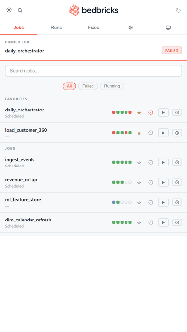

<p align="center">
  <picture>
    <source media="(prefers-color-scheme: dark)" srcset="logo-dark.png"/>
    
  </picture>
  <br/>
  <em>Manage your Databricks jobs from your phone. 🛏</em>
</p>

<p align="center">
  A mobile-first Google Apps Script web app for Databricks —<br/>
  dashboard, run history, AI-powered diagnostics, and notebook fixes,<br/>
  without ever opening Databricks.
</p>

<p align="center">
  <b>No server. No infra.</b> Just a Web App URL you open on your phone.
</p>

<p align="center">
  
  
  
</p>

<p align="center">
  
</p>

---

## Screenshots

📸 **[Full screenshot gallery → docs/SCREENSHOTS.md](docs/SCREENSHOTS.md)** — dashboard, AI diagnosis & fix, connection setup, and the optional AI hint.

---

## Guides

📄 **Setup & user guide** — [English](docs/install-guide.pdf) · [Español](docs/install-guide-es.pdf) — how to access, install on iOS/Android, and a full feature tour. Share it with your team.

---

## Features

### v1 — Core control
1. Job dashboard with status dots (last 5 runs per job)
2. Global run history (Runs tab)
3. Job detail: expandable task list (SUCCESS) or AI diagnosis + Repair (FAILED)
4. Trigger any job (▶ Run Now) and repair failed tasks without opening Databricks
5. **Think Fix** — an LLM inspects real table schemas from Hive Metastore via the Clusters Execute Command API and proposes a concrete find → replace patch for your notebook. Optional **hint field**: before diagnosing you can type a free-text suggestion (e.g. "the table was renamed to X") that the LLM weighs heavily — leave it empty for a fully automatic diagnosis
6. Multi-task failures, sub-jobs, and chained repairs (`latest_repair_id` auto-detected)

### v2 — Dashboard
7. **Pinned job widget** — fixed card above the job list: status badge + progress bar + elapsed time. Tap → detail view.
8. **Auto-refresh 30s** — activates when a job is RUNNING. Countdown in the header. Stops automatically.
9. **Quick filters** — `All` · `Failed` · `Running` chips. Client-side, combined with text search.
10. **Favorites ★** — toggle on any job row. Favorites float to the top. Persisted cross-device via `UserProperties`.
11. **Cancel run** — `✕ Cancel` button when a job is RUNNING. Confirm dialog + auto-refresh.
12. **Run history** — last 10 runs per job in the detail view (date, duration, status).
13. **Fixes tab** — log of all applied patches: notebook path, timestamp, find → replace preview. Max 50, FIFO.
14. **Dark/light mode** — SVG toggle, persisted in `localStorage`.

### v3 — Multi-user
15. **Per-user config** — host, token, LLM endpoint, and pinned job stored per-user in `UserProperties`. Credentials never shared via `ScriptProperties`.
16. **Setup wizard** — first-run full-screen modal. App blocks until host + token are configured.
17. **Pin Job (📌)** — pin any job as the featured widget. Toggle from the job row or the Settings tab.
18. **Settings tab (⚙)** — edit connection, choose LLM endpoint from a live dropdown, manage pinned job.
19. **Configurable LLM endpoint** — populated dynamically from `/api/2.0/serving-endpoints` (READY only).
20. **Marquee for long names** — job names that overflow scroll horizontally.

### v4 — i18n + New features
21. **Language toggle EN/ES** — full bilingual UI in Settings tab, persisted per-user in `UserProperties`. LLM prompts in `pensarFix` also switch language.
22. **Diff visual before applying fix** — unified diff (LCS line-by-line) replaces the two separate `<pre>` blocks. Lines removed in red (−), lines added in green (+).
23. **Tab Clusters** — live list of all workspace clusters with state badges (Running/Terminated/Starting/Error). Start and Terminate buttons without leaving the app.
24. **Scheduler one-shot** — schedule any job to run at a specific date/time. Uses GAS time-based triggers (`ScriptApp.newTrigger`). Pending scheduled runs visible and cancellable from Settings.
25. **Performance chart** — SVG bar chart of the last 10 run durations (colored by state) with fail-rate badge, shown in every job detail view.
26. **Task DAG** — visual dependency graph rendered as SVG in the job detail view. Nodes colored by state (green/red/blue), cubic Bézier edges, horizontal column layout by depth.

### v6 — Power features
27. **Drill into failed sub-jobs** — when a failed task is a `run_job` (sub-job), the detail view shows an **"open child job →"** button that navigates straight to the child run (where the real notebook failure + Think Fix live). Backend resolves `subjob_id` + `subjob_name`.
28. **Repair continues the DAG** — `repairRun` now sends a flat `rerun_tasks` array (fixed a `[["task"]]` nesting bug → 400) plus `rerun_dependent_tasks: true`, so repairing a failed task also re-runs the downstream tasks it had blocked. `latest_repair_id` persisted per-run in `UserProperties` (the API never returns `repair_history` in this workspace).
29. **Parameter editor** — ⚙ button in the detail header opens a modal of editable key-value rows (pre-filled from the job's default `base_parameters`). Triggers the job with `notebook_params` override via `triggerJob(jobId, params)`.
30. **Global search** — magnifier in the header opens a full-screen overlay that searches job names, job IDs, run IDs and run job names across loaded data. Tap a result to jump to its detail.
31. **Run comparison** — collapsible picker of two runs of the same job in the detail view. Side-by-side table of per-task duration with a signed delta in seconds (green faster / red slower). Backend adds per-task `duration_ms` to `run_history_with_tasks`.

### v7 — Multi-workspace
32. **Multiple workspaces** — save several Databricks workspaces (name + host + token) and switch the active one from **Settings → Workspaces**. The whole app (jobs, runs, clusters, fixes) reloads for the active workspace. Each workspace keeps its own token, LLM endpoint and pinned job; language is global. Config migrates automatically from the old single-workspace shape. All per-user in `UserProperties` — no shared credentials, no backend.
33. **Universal icon UI + spinners** — loading states render an animated spinner; primary actions are compact icons (`▶` run, `✓` apply, `✕` cancel, `‹` back, `🔧 Repair`, `💡 Think Fix`) with localized tooltips (`data-i18n-title`). Fully bilingual EN/ES including the AI diagnosis and the Task Code Viewer (previously hard-coded). Expandable **Fixes** entries with full red/green diffs.

---

## Architecture

```
Phone
  │
  ▼
[Web App URL]
  │  google.script.run.*()
  ▼
[codigo.gs — Apps Script V8]
  │
  ├─ getDashboard()
  │    └─ /api/2.1/jobs/list + /api/2.1/jobs/runs/list (last 5 runs per job)
  │
  ├─ getOrchestratorStatus()
  │    └─ /api/2.1/jobs/runs/list?job_id={pinned_job_id}&limit=1
  │    └─ (if RUNNING) /api/2.1/jobs/runs/get → count SUCCESS tasks
  │
  ├─ getJobDetail(jobId)
  │    └─ /api/2.1/jobs/runs/list?limit=10 → run_history
  │    └─ (if FAILED) tasks + thinkFix
  │
  ├─ triggerJob(jobId)          └─ POST /api/2.1/jobs/run-now
  ├─ repairRun(runId, taskKeys) └─ POST /api/2.1/jobs/runs/repair
  ├─ cancelRun(runId)           └─ POST /api/2.1/jobs/runs/cancel
  │
  ├─ pensarFix(runId, taskKey, lang, userHint)
  │    └─ (optional userHint injected into both LLM passes via _buildHintBlock)
  │    └─ LLM decides which DESCRIBE TABLE to run
  │    └─ /api/1.2/contexts/create + /api/1.2/commands/execute (Hive Metastore)
  │    └─ LLM proposes find → replace with real schema
  │
  ├─ aplicarFix(path, find, replace)
  │    └─ /api/2.0/workspace/export → replace → /api/2.0/workspace/import
  │
  ├─ getFavorites() / toggleFavorite(jobId)    — UserProperties
  ├─ getFixHistory()                            — UserProperties
  ├─ getConfig() / saveConfig(config)          — UserProperties 'bedbricks_config'
  ├─ getServingEndpoints()                      — /api/2.0/serving-endpoints (READY only)
  ├─ setPinnedJob(jobId, jobName) / clearPinnedJob()
  │
  └─ doGet() → Index.html

[Index.html — mobile UI]
  ├─ Header: logo + dark/light toggle + ↻ auto-refresh countdown
  ├─ Tab Jobs: pinned job widget + search + filters + job list with ★ 📌
  ├─ Tab Runs: global run history
  ├─ Tab Fixes: applied patches log
  ├─ Tab Settings (⚙): connection, LLM endpoint, pinned job
  └─ Detail view: status + run history + Cancel + AI diagnosis + Repair + Think Fix
```

---

## Persistence

All data lives in Google's `UserProperties` — per-user, cross-device, no external database.

| Key | Contents | Limit |
|-----|----------|-------|
| `bedbricks_config` | `{active, lang, workspaces: [{name, host, token, llm_endpoint, pinned_job_id, pinned_job_name}]}` | — |
| `repair_<runId>` | last `repair_id` for chained repairs | — |
| `favorites` | JSON array of job IDs | — |
| `fix_history` | `[{ts, notebook_path, find_preview, replace_preview}]` | 50 (FIFO) |

---

## Access control

By default, anyone with the link can access the app. To restrict to specific emails, add `ALLOWED_EMAILS` in **Apps Script → Project Settings → Script Properties**:

```
Key:   ALLOWED_EMAILS
Value: alice@example.com,bob@example.com
```

Leave empty (or don't add it) to allow any Google account.

---

## Setup

You need: a **Databricks workspace + personal access token** (`dapi...`) and a **Google account**. Everything else depends on which install method you choose.

> **First-time deployment** (any method): after the code is in Apps Script you must create the Web App once manually — see [Create the Web App](#create-the-web-app) below.

---

### Method A — Manual (no tools required)

The simplest path. Just copy two files into the Apps Script editor.

1. Go to [script.google.com](https://script.google.com) → **New project** → rename it to `Bedbricks`
2. Delete the default `Code.gs` content. Paste the contents of [`apps_script/codigo.gs`](apps_script/codigo.gs)
3. **File → New → HTML file** → name it `Index` → paste the contents of [`apps_script/Index.html`](apps_script/Index.html)
4. **File → New → Script file** (optional) or edit `appsscript.json` via **Project Settings → Show appsscript.json** → paste [`apps_script/appsscript.json`](apps_script/appsscript.json)
5. Save → proceed to [Create the Web App](#create-the-web-app)

---

### Method B — CLASP (Node.js CLI)

Google's official CLI. Handles auth automatically — no Cloud Console setup needed.

```bash
npm install -g @google/clasp
clasp login                      # opens browser for Google OAuth
clasp create --title "Bedbricks" --type webapp --rootDir apps_script
clasp push
```

Then proceed to [Create the Web App](#create-the-web-app).

> **Re-deploying after changes:**
> ```bash
> clasp push
> ```

---

### Method C — Python deploy script (automation / no Node.js)

No CLASP, no Node. Pure Python — useful for scripting or CI.

**One-time setup:**

1. Create a Google Cloud project at [console.cloud.google.com](https://console.cloud.google.com)
2. APIs & Services → Credentials → **Create credentials → OAuth 2.0 Client ID** → Application type: **Desktop App**
3. Enable the **Google Apps Script API** for your project
4. Copy Client ID and Client Secret

```bash
cp deploy_config.example.py deploy_config.py
# Fill in: SCRIPT_ID (from script.google.com → Project Settings)
#          CLIENT_ID and CLIENT_SECRET (from step above)
```

**Authenticate (first time only):**

```bash
python deploy_apps_script.py --auth
```

Opens a browser for Google OAuth. Token saved to `~/.apps_script_token.json`.

**Deploy:**

```bash
python deploy_apps_script.py
```

Then proceed to [Create the Web App](#create-the-web-app). After the first deployment, add `DEPLOYMENT_ID` to `deploy_config.py` and re-run to keep it updated automatically.

---

### Create the Web App

This step is the same regardless of install method. Do it once in the Apps Script editor:

1. **Deploy → New deployment** → Type: **Web App**
2. Execute as: **User accessing the web app** ← important (see note below)
3. Who has access: **Anyone within `<your org>`** (or "Anyone with a Google Account")
4. **Deploy** → copy the **Web App URL**

Open the URL on your phone. The setup wizard will ask for your Databricks host and token — that's it.

> **⚠ Execute as — must be "User accessing the web app".** Bedbricks stores each person's host/token/workspaces in their own `UserProperties`, which is keyed to the *effective* user. If you deploy with "Execute as: Me", **every visitor runs as you and shares your token and workspaces** — the per-user model breaks. "User accessing" makes each person run as themselves (their own token, isolated). The trade-off: each user authorizes the OAuth scopes once on first open (a normal Google consent screen).
>
> **This setting is UI-only.** The `webapp.executeAs`/`access` values in `appsscript.json` are *not* applied when you create/update a deployment via the API or `clasp` — Google fixes them from the dialog at deployment-creation time. Set them in **Deploy → New deployment** (or Manage deployments → Edit) in the browser.

> **Updating** (after code changes): use **Deploy → Manage deployments → Edit → New version** instead of creating a new deployment, so your URL stays the same. (Changing *Execute as* on an existing deployment is often locked — if so, create a **New deployment**, which yields a new URL.)

---

### Optional: AI features (Think Fix)

Think Fix requires a Databricks **Model Serving endpoint**. If you have one, you can select it from the Settings tab (⚙) — it's populated automatically from your workspace. The app works fully without it; Think Fix is just hidden.

---

## Development

### File structure

```
bedbricks/
├── README.md
├── deploy_apps_script.py        ← deploy via Apps Script API (no CLASP needed)
├── deploy_config.example.py     ← template: copy to deploy_config.py
├── deploy_config.py             ← gitignored — your Script ID + Deployment ID
├── .gitignore
├── apps_script/
│   ├── appsscript.json          ← manifest: OAuth scopes, runtime V8
│   ├── codigo.gs                ← backend: GAS functions
│   └── Index.html               ← frontend: mobile UI, embedded logo
└── tests/
    └── test_logic.js            ← 78 pure-logic tests (no GAS APIs required)
```

### Tests

```bash
node tests/test_logic.js
# 81 passed, 0 failed
```

Tests cover all pure helpers: `_parseConfig`, `_isConfigComplete`, `_parseServingEndpoints`, `_buildLlmPayload`, `_parseLlmResponse`, `_parseFailedTask`, `_parseFailedTasks`, `_buildRepairPayload`, `_parseFavorites`, `_toggleFavoriteLogic`, `_buildCancelPayload`, `_appendFixLog`, `_parseRunHistory`, `_extractTaskMeta`, `_getTaskChipType`, `_computeFlakiness`, `_gestureDelta`, `_buildManifest`, `_buildRunComparison`, `_globalSearch`, `_paramsToMap`, `_buildRunNowPayload`, `_buildHintBlock`.

---

## Changelog

| Date | Version | Change |
|------|---------|--------|
| 2026-06-04 | v1 | Initial: TDD scaffold, full GAS backend, dark mode frontend, deploy script |
| 2026-06-04 | v2–v7 | Remote control: dashboard, job detail, trigger. Tab Jobs, Tab Runs, detail view. |
| 2026-06-04 | v8–v12 | `repairRun()` with auto `latest_repair_id`. Timezone. Refresh button. |
| 2026-06-04 | v13–v18 | `pensarFix()` — LLM + Hive Metastore → concrete find → replace. |
| 2026-06-04 | v19–v22 | Multi-task failures, sub-jobs, Repair All. |
| 2026-06-04 | v23–v25 | Databricks-inspired theme: CSS vars, square dots, bordered badges. |
| 2026-06-05 | v26 | Widget, auto-refresh 30s, filters, favorites, cancel run, run history, Fixes tab. |
| 2026-06-05 | v27–v30 | Bedbricks rebrand: embedded logo, dark/light SVG toggle. |
| 2026-06-05 | v31–v33 | Multi-user: per-user config, setup wizard, Settings tab (⚙), Pin Job (📌), configurable LLM endpoint, English UI, marquee for long names. |
| 2026-06-05 | v42 | Full i18n EN/ES: `STRINGS` dict + `t(key)` + `setLang()`, `data-i18n` attrs, persisted in `UserProperties`. LLM prompts bilingual. |
| 2026-06-05 | v43 | Diff visual (LCS), Tab Clusters (start/terminate), Scheduler one-shot (GAS triggers), Perf chart (SVG), Task DAG (SVG). |
| 2026-06-05 | v44 | Replace emoji icons (clusters tab, schedule btn) with minimalist SVG icons. |
| 2026-06-05 | v45 | **Critical fix:** detail view stuck on "Loading..." for any run. Root cause: `var t = data.tasks[i]` inside `renderDetail()` hoisted `t`, shadowing the global i18n `t()` → `TypeError: t is not a function` in the success handler (silent). Fix: rename loop var `t` → `task`. |
| 2026-06-05 | v46–v49 | Logo doubled in visible size (58px → 96px); header switched to `height:auto` to fit the logo. |
| 2026-06-09 | v50 | PWA installable (manifest + iOS/Android meta tags). Swipe gestures: tab navigation, swipe-row quick actions (▶ trigger / ★ favorite), pull-to-refresh. Per-task flakiness score: % badge in task list and DAG (red >20%, amber 10–20%). |
| 2026-06-09 | v51–v52 | **Task Code Viewer:** `{ } code` / `↗ subjob` chips per task row. Notebook tasks: 30-line preview with fade + expand to full code (on-demand `workspace/export`). run_job tasks: panel with referenced job name + direct navigation. `_extractTaskMeta()` + `getNotebookPreview(path, full)`. Light mode as default theme. 51 tests. |
| 2026-06-09 | v53 | **Light-mode fix:** diagnosis card `strong` and inline `code` used fixed dark colors (invisible on light bg). Fixed to `var(--text)` / explicit light color. |
| 2026-06-10 | v54 | **Drill into failed sub-jobs:** a failed `run_job` task now shows an "open child job →" button that navigates to the child run. `_parseFailedTasks` captures `subjob_id`; `getJobDetail` resolves `subjob_name`. |
| 2026-06-10 | v55 | **Repair fixes:** `rerun_tasks` was sent nested (`[["task"]]`) → 400 MALFORMED_REQUEST (Repair was fully broken). Now a flat array + `rerun_dependent_tasks:true` (the DAG continues). `latest_repair_id` persisted in `UserProperties` (the API never returns `repair_history`). Verified against live Databricks. |
| 2026-06-10 | v56 | **Critical fix — blank FAILED screen:** `flakiness` (declared in `renderDetail`) was used inside `renderFailedUI` (a separate function) → `ReferenceError` → the whole FAILED UI failed to render for jobs with a DAG of ≥2 tasks. Broken since v50. Fix: pass `flakiness` as a parameter. |
| 2026-06-10 | v57 | **V6 — Power features:** parameter editor (key-value modal → `notebook_params`), global search (header overlay: jobs/runs/IDs), run comparison (two-run picker + per-task duration table with delta). 69 tests. |
| 2026-06-10 | v58 | Fix iOS auto-zoom: search and params inputs to `font-size:16px` (the full-screen overlay pushed Back off-screen). |
| 2026-06-10 | v59 | Fix run comparison "?": `_fetchRunsWithTasks` used the 2.1 endpoint (400 on large runs) and parsed the error body as an empty run. Now 2.2 + HTTP-code check + fallback. Also fixes flakiness on large jobs. |
| 2026-06-10 | v60 | Comparison table `table-layout:fixed` + Task column with ellipsis (no longer overflows the screen). |
| 2026-06-10 | v61–v62 | Per-job status dots: `runs/list?job_id&limit=5` per job in parallel (mirrors Databricks' last 5). Reverted global `limit=100` → 25 (the endpoint max). |
| 2026-06-10 | v63 | **Universal UI:** loading spinner, icon set (▶ ✓ ✕ ‹), fixed hard-coded translations (Repair, Task Code Viewer, Install) + `data-i18n-title` for localized tooltips. |
| 2026-06-10 | v64 | 🔧 Repair / 💡 Think Fix with text labels (more intuitive); sun icon with a filled center (no longer mistaken for the settings gear); **bilingual AI diagnosis** (ES/EN prompt + `getJobDetail(jobId, lang)`). |
| 2026-06-10 | v65 | Smarter Think Fix for missing tables: searches the metastore (`SHOW TABLES`) for the correct one, or comments out the line as a last resort (never an empty fix). |
| 2026-06-10 | v66 | Fix: `switchTab` did not close the `detail-view` overlay → it stayed underneath when changing tabs. |
| 2026-06-10 | v67 | **Detailed Fixes log:** expandable entries with full red/green diffs; backend stores `find`/`replace` (cap 800) + a `UserProperties` size guard. |
| 2026-06-10 | v68 | **Multi-workspace:** config refactored to `{active, lang, workspaces[]}` with automatic migration; add/edit/delete/switch from Settings; `_getConfig_()` returns the active workspace flattened (no call-site changes). 78 tests. |
| 2026-06-10 | v69 | Removed model-specific labels: AI diagnosis card now reads "AI Diagnosis" / "Diagnóstico IA" (the endpoint is configurable). |
| 2026-06-10 | v71 | **Log out / reset** button in Settings → `resetConfig()` clears all saved workspaces & tokens and returns to the setup wizard. |
| 2026-06-10 | v72 | Setup screen polish: corrected tagline, Connect button as a single arrow, and **trimmed the logo** (was 480×251 with ~64% transparent margin → cropped to content) so it renders crisp and the layout is balanced. |
| 2026-06-11 | v73 | **Think Fix hint:** tapping 💡 Think Fix now opens an optional free-text field — give the AI a suggestion (e.g. "the table was renamed to X") before it diagnoses. The hint is injected into both LLM passes (schema discovery + fix) and bilingual; the system prompt weighs it heavily but still validates against the real schemas. Empty hint = fully automatic, same as before. New pure helper `_buildHintBlock(hint, lang)` + 7 tests (81 total). |
| 2026-06-11 | v74 | Public-repo hygiene: replaced internal example identifiers with neutral ones (`analytics.customers_v2`, generic job IDs) across the hint placeholder and `test_logic.js` fixtures, so nothing real-world ships in the open-source release. No behaviour change. |
| 2026-06-12 | v78 | Think Fix no longer auto-focuses the hint textarea (the mobile keyboard popped up on every tap). The hint field just reveals + scrolls into view; the keyboard opens only if the user taps it — the hint is optional. |
| 2026-06-12 | v77 | After a successful Apply Fix, that task's **Think Fix button also locks** (disabled) — not just the apply button — so a patched notebook can't be re-diagnosed by accident. |
| 2026-06-12 | v76 | Code-error warning banner reworked: dropped the stray `! ` text prefix, added a proper ⚠ icon in a flex layout (icon aligned to the first line), and reworded the message to point at Think Fix (EN/ES). |
| 2026-06-12 | v75 | **Three fixes.** (1) **Per-task AI diagnosis:** when a job fails with several FAILED tasks, each task now gets its OWN error trace + its OWN diagnosis card (before, only the first task was diagnosed). `getJobDetail` diagnoses per task; `renderFailedUI` renders one diagnosis card per failed task (+ its own raw log and Think Fix). (2) **Removed swipe-to-switch-tabs:** the horizontal tab-swipe gesture hijacked horizontal scroll when reading full notebook code in the detail view — removed; pull-to-refresh and swipe-on-a-row quick actions stay. (3) **Apply-fix button locks:** each Think Fix panel owns its apply button (unique id + per-panel fix in `_fixByPanel`) and stays disabled after a successful apply — no more repeat taps (previously all panels shared `btn-apply-fix`/`_pendingFix`, so in multi-task only the first button disabled). |
