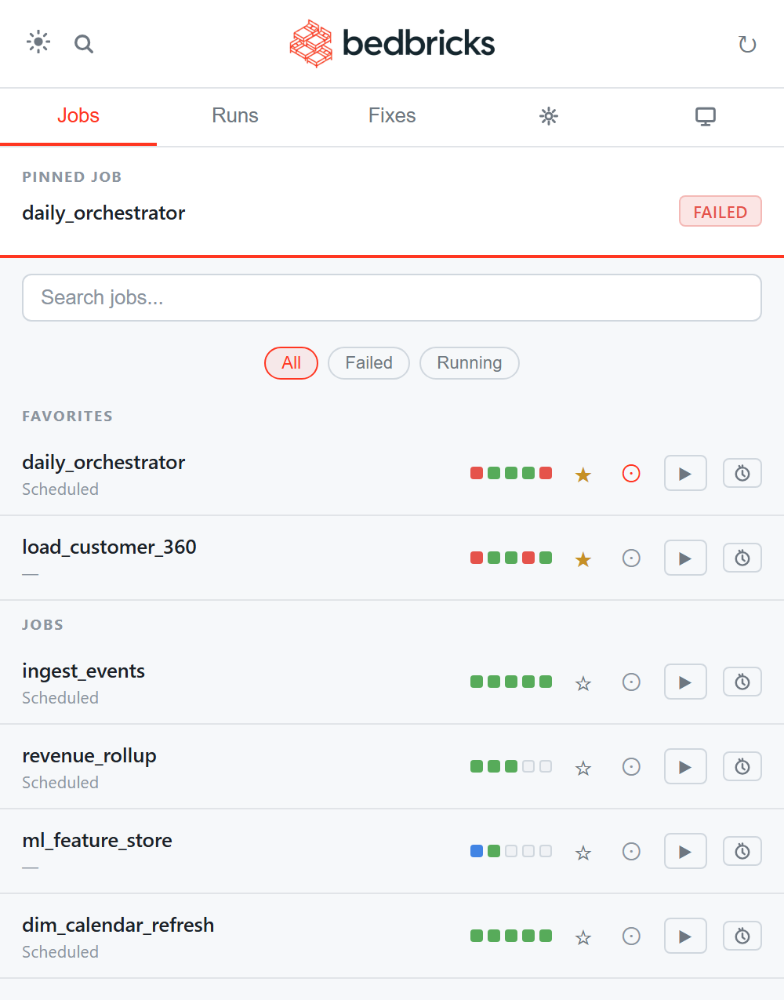
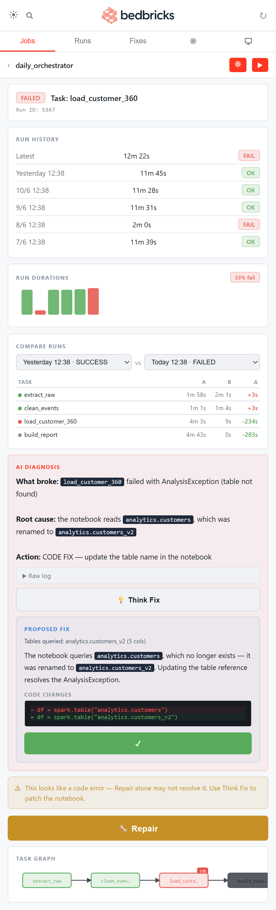
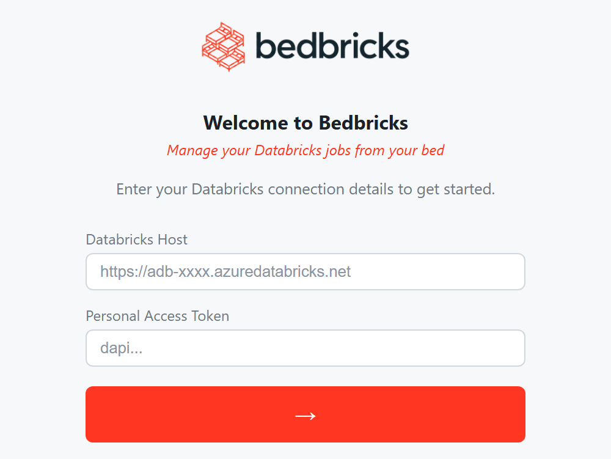
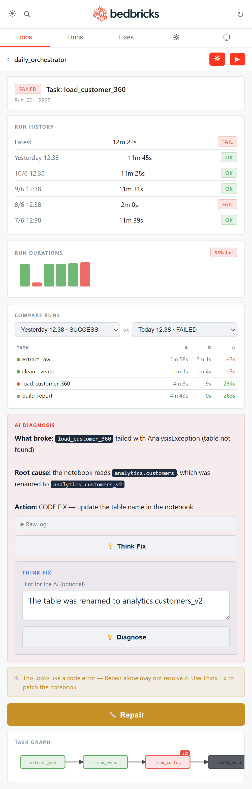

# Bedbricks — Screenshots

A visual tour of the app. For the animated walkthrough, see the demo GIF in the [README](../README.md).

<table>
  <tr>
    <td align="center" width="33%"></td>
    <td align="center" width="33%"></td>
    <td align="center" width="33%"></td>
  </tr>
  <tr>
    <td align="center"><b>Dashboard</b> All jobs, status dots, pinned widget &amp; favorites</td>
    <td align="center"><b>Diagnose &amp; fix</b> AI diagnosis, Think Fix patch &amp; Repair — from your phone</td>
    <td align="center"><b>Connect</b> Per-user setup: your own host &amp; token</td>
  </tr>
  <tr>
    <td align="center" width="33%"></td>
    <td align="center" colspan="2"><b>Hint the AI (optional)</b> Before Think Fix diagnoses, optionally type a suggestion (e.g. a table was renamed) to steer it — or leave it empty for a fully automatic fix.</td>
  </tr>
</table>

---

← Back to the [README](../README.md)
